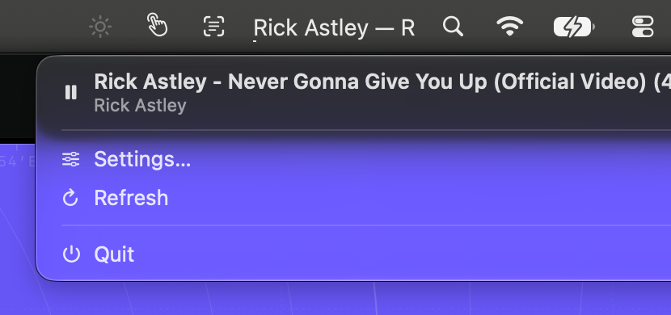

# Now Playing Menu

See what's playing — artist and title — right in the menu bar.

**[Download NowPlayingMenu.zip](https://github.com/yjujq/NowPlayingMenu/releases/latest/download/NowPlayingMenu.zip)**

## What it does

- Shows `Artist — Title` from Music, Spotify, browsers and anything else that appears in Control Center's Now Playing.
- A thin line under the title shows how far into the track you are.
- Click to play or pause; right-click for the Now Playing card.
- Settings for static, scrolling or paged text, width, alignment, font, size and speed.
- Uses almost no CPU: the motion runs in Core Animation, not on a timer.

## Manual



1. **Start playing** something anywhere — the menu bar shows `Artist — Title`, with a thin progress line under it.
2. **Click it** to play or pause.
3. **Right-click it** (two-finger click on a trackpad) for the menu. At the top is the same Now Playing card as in Control Center: artwork, title and artist, previous / play-pause / next, and a progress bar you can drag to jump through the track. Click the title to fold the card to one row (and again to open it out); click the artwork to bring the playing app forward.
4. The **gear** in the top-left corner of the artwork opens **Settings**. There choose how the text moves, its width, font and size, and whether the progress line shows. **Quit Now Playing Menu** is at the bottom of Settings.

## Install

1. Download **NowPlayingMenu.zip**, unzip it and move **NowPlayingMenu.app** to Applications.
2. Open it. The app is not notarized, so macOS stops it the first time: open **System Settings → Privacy & Security** and click **Open Anyway**.

## Requirements

macOS 13 or later.

## Permissions

None.

## Good to know

- Track details come from the system's private MediaRemote framework, read through `osascript`. Fine for personal use; it could not ship on the Mac App Store.
- Artwork is fetched by the system's `/usr/bin/perl`, which loads a small library shipped inside the app: since macOS 15.4 only Apple-signed processes may ask for it.
- Some sources, such as video in a browser, publish no track length — then there is no progress line.

## Build from source

```sh
swift run
```

Or `./make-app.sh --install` to build the app into Applications.

## Privacy

Now Playing Menu collects nothing and makes no network connections. Track details are read from your own Mac and stay there.

## License

MIT — see [LICENSE](LICENSE).
